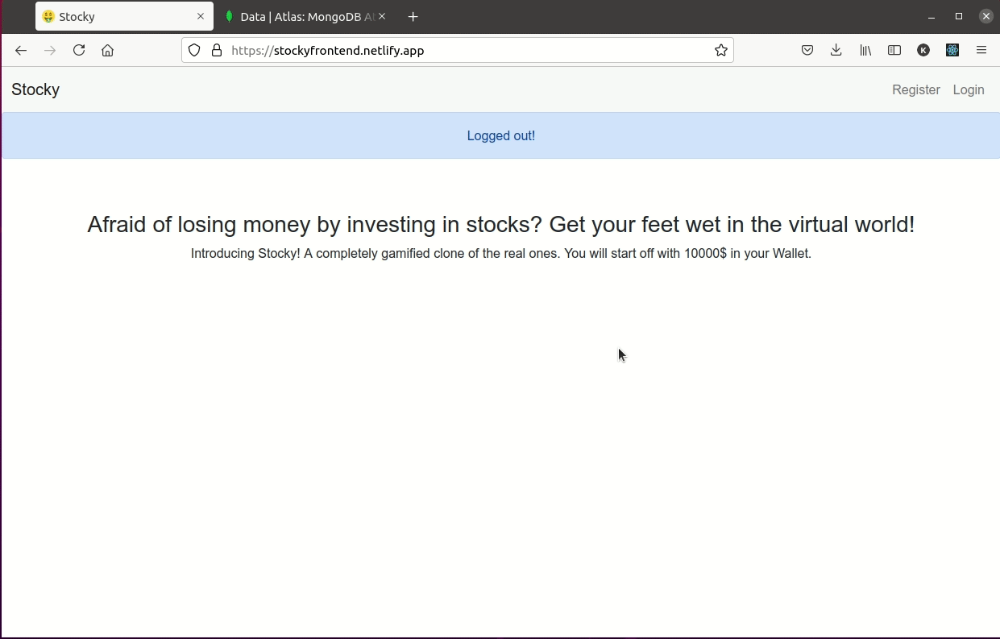

CS50's iconic Finance Project built from scratch making use of the MERN Stack.
Realtime Stock Prices were fetched by api calls to the iex cloud server.
Queries have to be made by the symbol of the stock.(Google the company's stock xD)

(Click Me!)
Hosted on: https://stockyfrontend.netlify.app/
Since heroku dynos take some time to wake up, the site may be unresponsive. In that case click on the backend link(Heroku) and wait till its loaded and then try again.(The initial login or register might take some time..)

Frontend on: (Netlify) https://stockyfrontend.netlify.app/
Backend on: (Heroku)https://stockybackend.herokuapp.com/

Todo:
Optimizing the index route which is relatively slower since prices for each stock has to be updated everytime.

